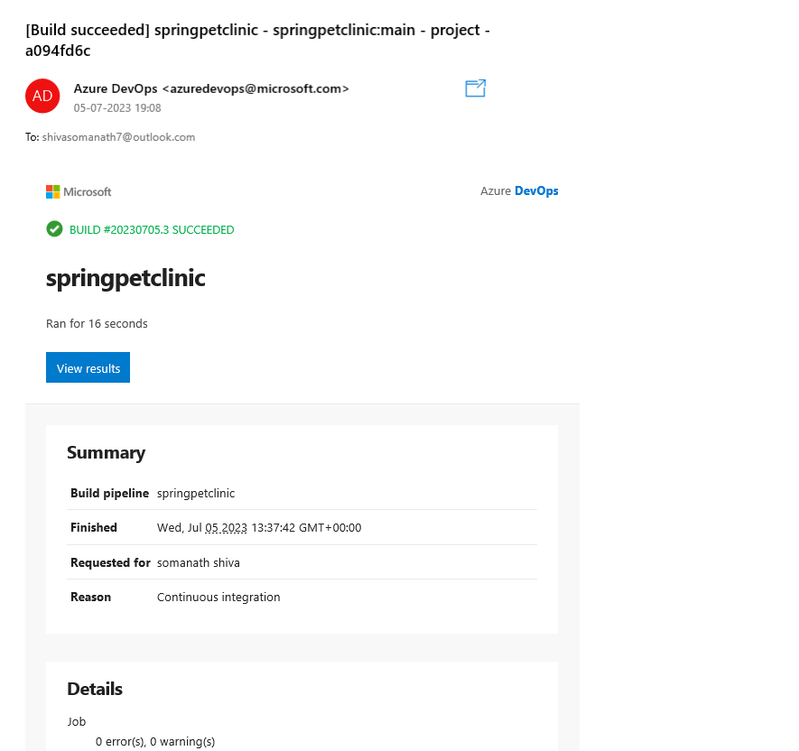
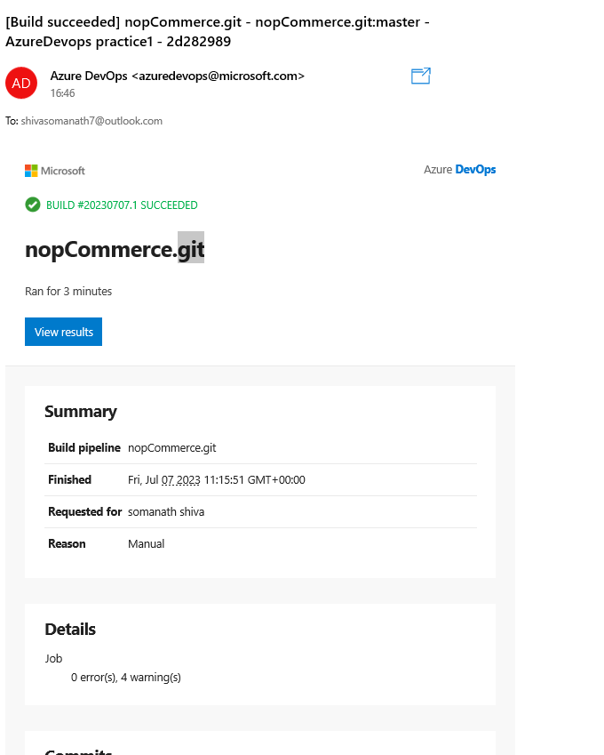

# Task 1 spring pet clinic: 
---------------------------

Manual Build:
------------
*  sudo apt update
*  sudo apt install openjdk-17-jdk maven -y
*  git clone https://github.com/spring-projects/spring-petclinic.git
*  cd spring-petclinic
*  mvn package 

Pipeline:
---------
```yaml

trigger:
- main

pool:
  name: default
steps:
  - task: Maven@3
    inputs: 
      mavenPOMFile: 'pom.xml' 
      goals: 'package'
      publishJUnitResults: true 
      testResultsFiles: '**/surefire-reports/TEST-*.xml'
      testRunTitle: 'unittests'
```




# Task 2 Game of life:
---------------------------
      
Manual steps
------------
- sudo apt install openjdk-8-jdk
- sudo apt install maven 
- git clone https://github.com/wakaleo/game-of-life.git
- cd gol
- mvn package
---
Pipeline:
---------
```yaml
trigger:
  - master
  
pool:
  name: default

jobs:
  - job: buildjob
    displayName: Build and Package Game of life
    steps:
      - task: Maven@3
        inputs:
          mavenPOMFile: 'pom.xml'
          goals: 'package'
          publishJUnitResults: true
          testResultsFiles: '**/surefire-reports/TEST-*.xml'
```


# Task 3 Nop Commerce:
----------------------
      
Manual steps
------------
* sudo apt update
* sudo apt-get install -y dotnet--7.0
* git clone https://github.com/nopSolutions/nopCommerce.git
* git checkout master
* cd nopCommerce/
* git checkout master
* dotnet restore src/NopCommerce.sln
* dotnet build src/NopCommerce.sln


Pipeline:
---------
```yaml

trigger:
  - master

pool:
  vmImage: 

steps: 
  - task: DotNetCoreCLI@2 
    inputs: 
      command: 'restore'
      projects: src/NopCommerce.sln
  - task: DotNetCoreCLI@2 
    inputs: 
      command: 'build'
      projects: src/NopCommerce.sln

```



### TASKS:
---------- 
1. write pipeline for SPC Or NOP build and deploy through ansible ( who knows terraform create infrastructure)
2. write pipeline for SPC Or NOP to build and deploy through k8s.;

#  write pipeline for SPC Or NOP build and deploy through ansible ( who knows terraform create infrastructure)
- Build stage 
 ```yaml
 ---
  trigger:
    - master

  stages:
    - stage: buildstage
      displayName: build workshop
      pool:
        vmImage: ubuntu-22.04
      jobs:
        - job: buildJob
          displayName: Build and Publish
          steps:
            - task: DotNetCoreCLI@2
              inputs:
                command: build
                projects: src/NopCommerce.sln
            - task: CopyFiles@2
              inputs:
                contents: 'src/Presentation/Nop.Web/bin/Debug/net7.0/**'
                targetFolder: $(Build.ArtifactStagingDirectory)
            - task: PublishBuildArtifacts@1
              inputs:
                pathToPublish: $(Build.ArtifactStagingDirectory)
                artifactName: nop
```


